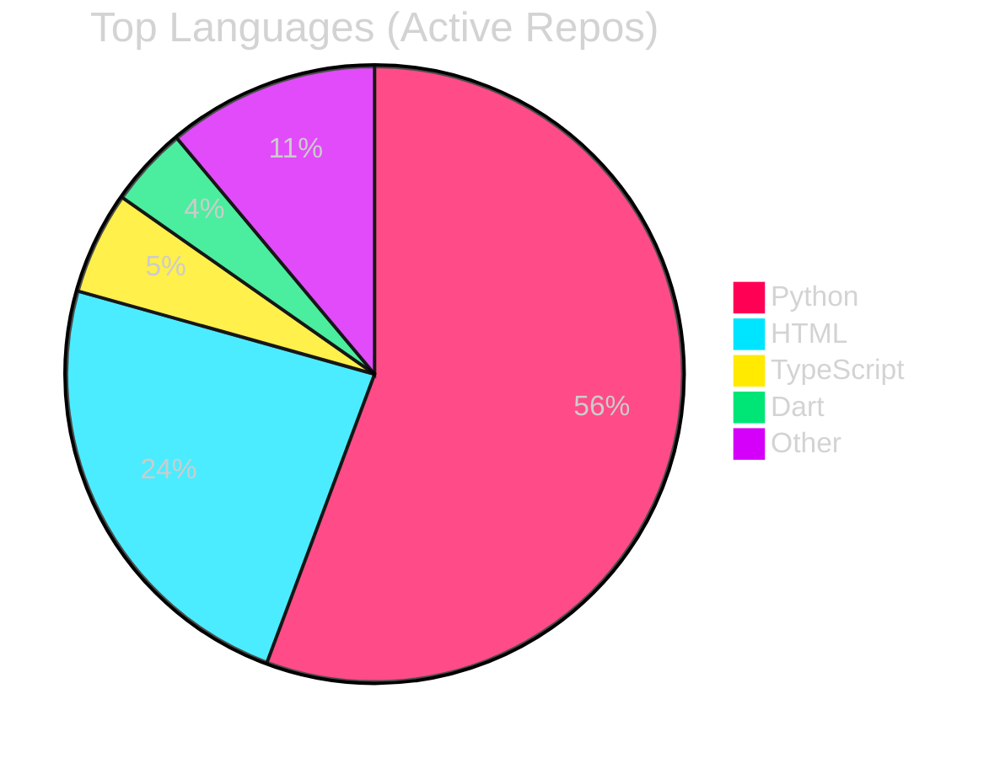

# Hi there, I'm Nzettodess! 👋

Welcome to my GitHub profile! I'm a passionate developer focusing on building performant and insightful tools.

## 🛠️ Tech Stack

  

---

<table>
<tr>
<td valign="top" width="50%">

## 📊 Developer Insights
<!-- START_SECTION:stats -->
| 📊 Metric | Count |
|---|---|
| 📦 Total Repositories | 33 |
| ⭐ Total Stars Earned | 2 |
| 💻 Commits (Last Year)| 1401 |
| ⏳ Account Age | 7 yrs, 0 mos |
<!-- END_SECTION:stats -->

</td>
<td valign="top" width="50%">

## 🏆 Current Focus (Last 365 Days)
<!-- START_SECTION:languages -->

<!-- END_SECTION:languages -->

</td>
</tr>
</table>

---

## 🚀 Featured Projects

### ⚖️ [AI Act Compliance Suite (Governance)](https://github.com/Nzettodess/Gemini-Hackathon/tree/main)
*Python, Gemini API, SQLite*
- **Agentic Automation:** Designed 5 modular Agent Plugins to decouple specialized AI Agents, enabling autonomous, zero-touch compliance verification for EU legislative articles.
- **Auto-Documentation:** Engineered an engine parsing 20+ file types within 500k-character contexts, automating the generation of complex visual architectures via Mermaid.js.
- **Resilience:** Standardized system integration across teams by deploying a High Availability fallback framework, guaranteeing 99.9% system uptime.

### 🪐 [Orbit: Cross-Platform Event Sync](https://github.com/Nzettodess/Orbit)
*Flutter, Firebase, Vercel*
- **Scalable Architecture:** Spearheaded the deployment of a scalable backend architecture to manage secure authentication, guaranteeing real-time data synchronization across Web, iOS, and Android platforms.
- **Automated Pipelines:** Automated cross-platform communication pipelines using OneSignal, achieving a 100% successful push-notification delivery rate.

### ⚔️ [Astraeus Protocol (Multiplayer P2P Roguelite)](https://www.youtube.com/watch?v=yhu8UNkjQRc)
*C++, Unreal Engine 5, EOS*
- **Network Optimization:** Optimized a P2P synchronization layer (Blueprints/EOS) with RPCs to manage state replication for 30+ network actors at a 60Hz tick rate.
- **Procedural Generation:** Developed a deterministic procedural generation engine using seed-based logic to guarantee 100% valid navigational pathing with zero runtime errors.
- **Performance:** Accelerated replication performance by implementing relevance-based culling, minimizing bandwidth overhead for synchronous multiplayer states.

### 🧟 [Moral Nexus (AI-Driven Survival Game)](https://youtu.be/jfWJqOpxPrM?si=391F8AwrKuUPRPo)
*Unreal Engine 5, Blueprints*
- **Engineering Leadership:** Collaborated with a 4-person engineering team using Agile, managing version control and merge conflicts for a 4-month cycle.
- **Stealth AI Systems:** Developed sight-based AI perception logic and time-synchronized Day/Night cycles to dynamically alter NPC patrolling behaviors.
- **Systems Integration:** Coordinated environmental states across 3 game zones by implementing a global event-driven architecture.

---

## 🌟 Recent Community Engagement

Click to view my recently starred repositories

<!-- START_SECTION:activity -->
- ⭐ Starred [Panniantong/Agent-Reach](https://github.com/Panniantong/Agent-Reach) on 2026-06-18
- ⭐ Starred [KKKKhazix/khazix-skills](https://github.com/KKKKhazix/khazix-skills) on 2026-06-02
- ⭐ Starred [study8677/architecture-copilot](https://github.com/study8677/architecture-copilot) on 2026-06-01
- ⭐ Starred [microsoft/Webwright](https://github.com/microsoft/Webwright) on 2026-06-01
- ⭐ Starred [FlashML-org/flashlib](https://github.com/FlashML-org/flashlib) on 2026-05-28
<!-- END_SECTION:activity -->

---
⭐️ Automatically generated by [Nzettodess](https://github.com/Nzettodess)
