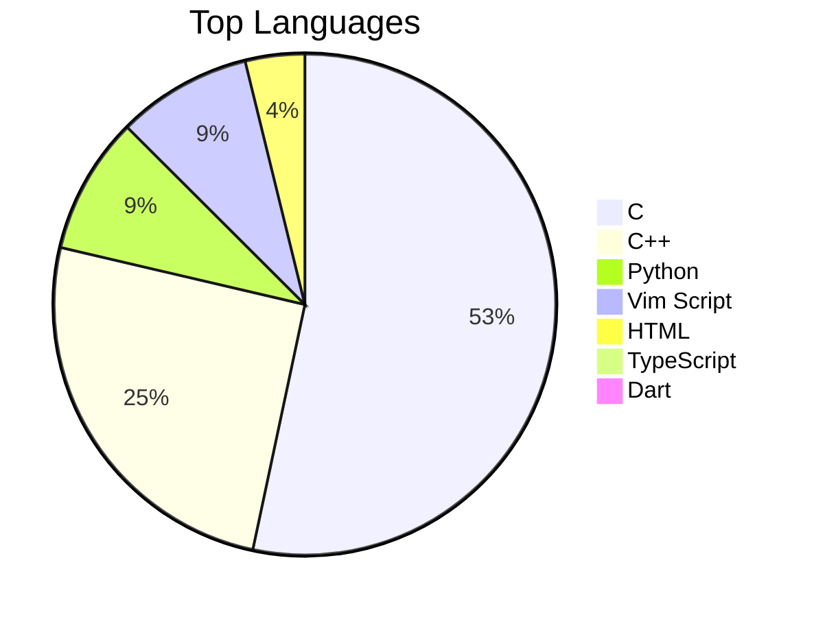

# Hi there, I'm Nzettodess! 👋

Welcome to my GitHub profile! I am a passionate developer who loves building cool things.

## 🛠️ Tech Stack & Tools
<!-- Add your tech stack badges here. You can find more at https://simpleicons.org/ -->

## 📊 My GitHub Stats
<!-- START_SECTION:stats -->
| 📊 Metric | Count |
|---|---|
| 📦 Total Repositories | 33 |
| ⭐ Total Stars | 1 |
| 🍴 Total Forks | 4 |
<!-- END_SECTION:stats -->

## 🏆 Top Languages
<!-- START_SECTION:languages -->

<!-- END_SECTION:languages -->

## 📈 Recent Activity
<!-- START_SECTION:activity -->
- No recent push activity found.
<!-- END_SECTION:activity -->

---
⭐️ From [Nzettodess](https://github.com/Nzettodess)
